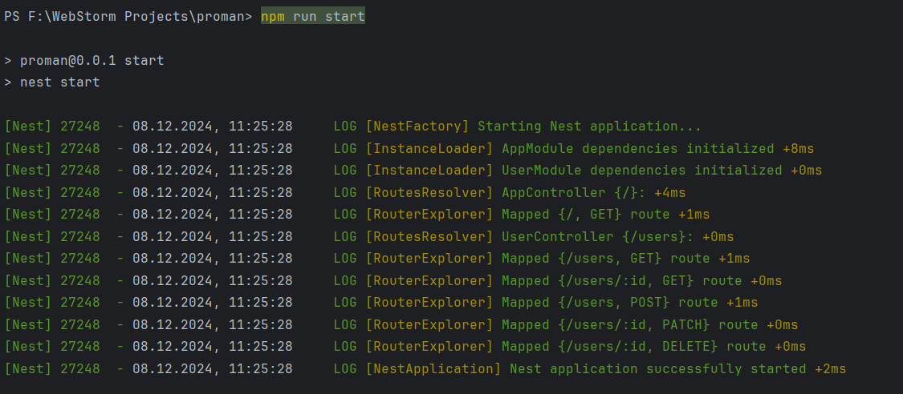
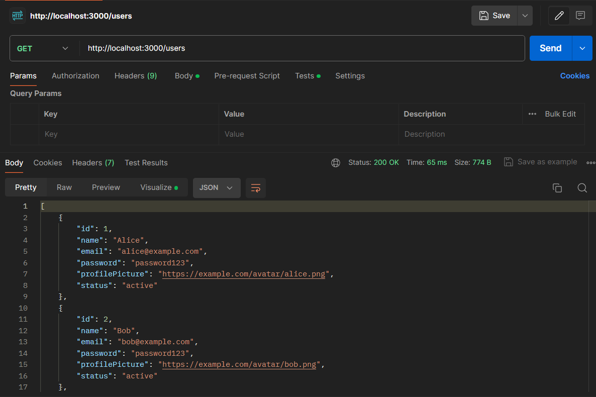
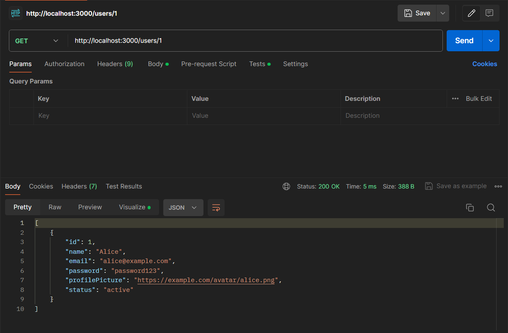
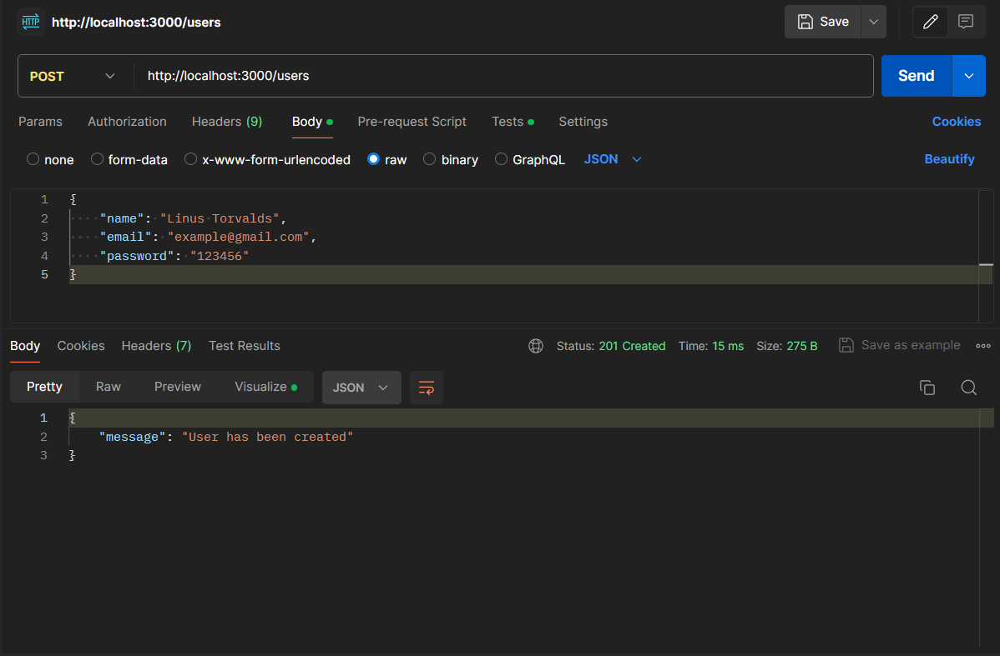
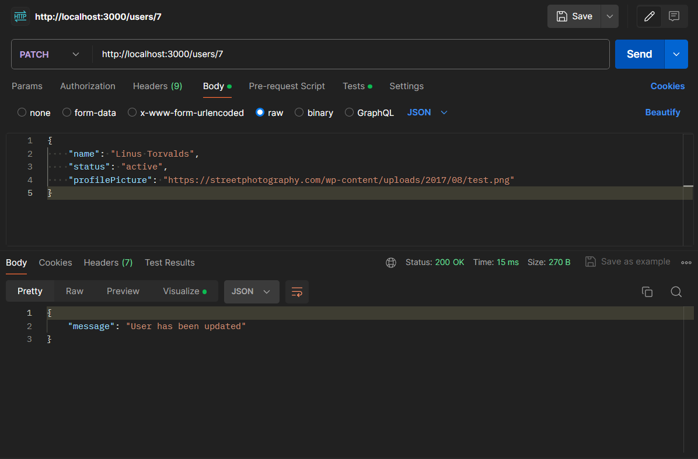
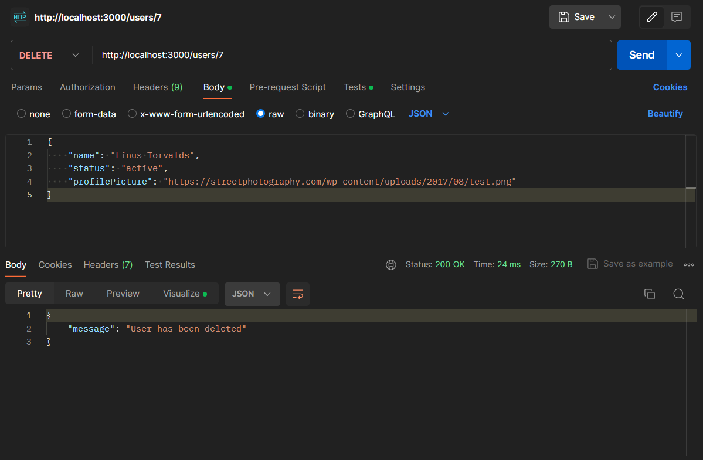
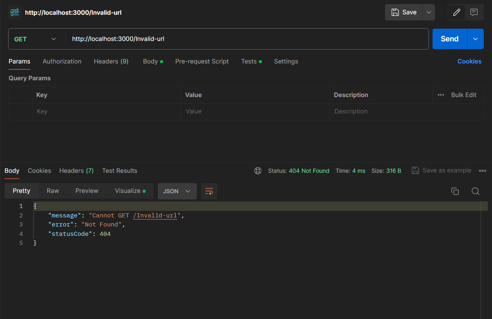
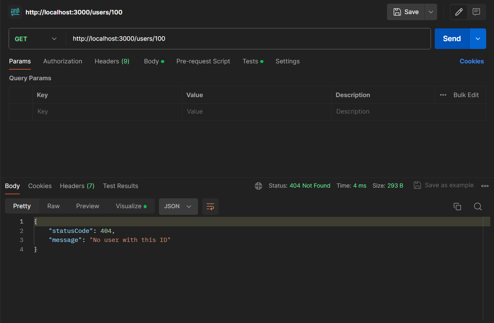
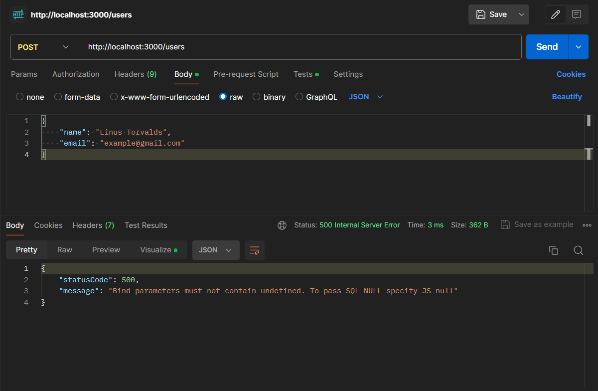
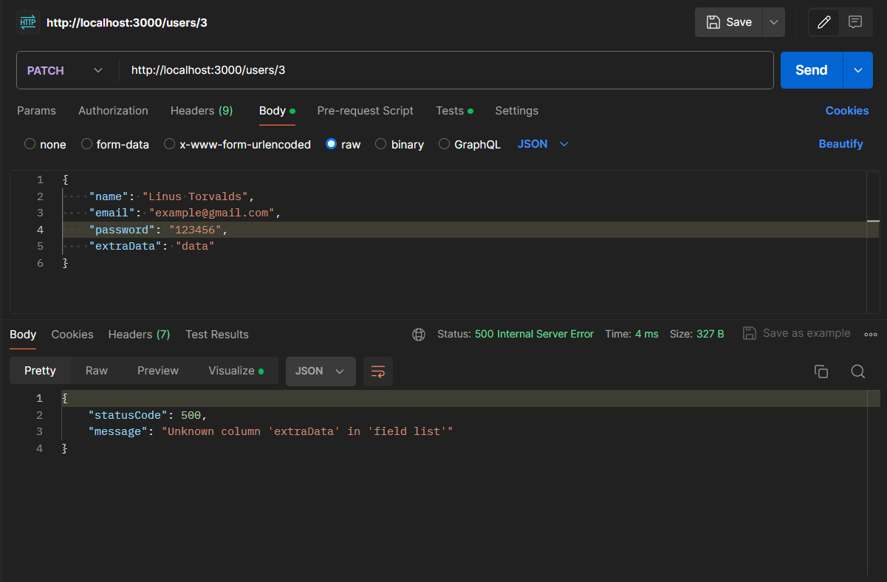

# Тестування працездатності системи

### Робота сервера

### GET /users

### GET /users/:id

### POST /users

### PATCH /users/:id

### DELETE /users/:id

## Виняткові випадки

### GET /invalid-url

### GET /users/:id

### POST /users

### POST /users

### PATCH /users/:id

### PATCH /users/:id

### DELETE /users/:id

